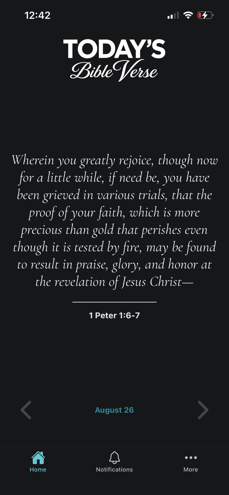
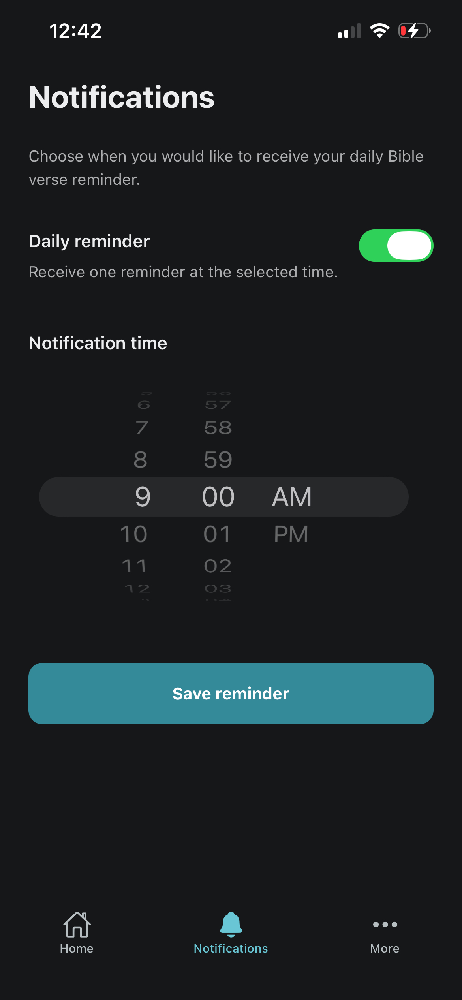
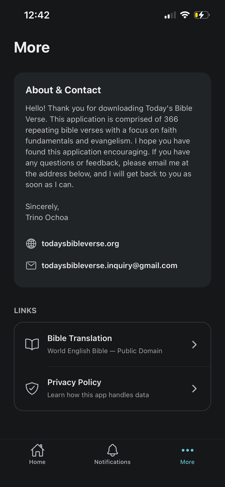
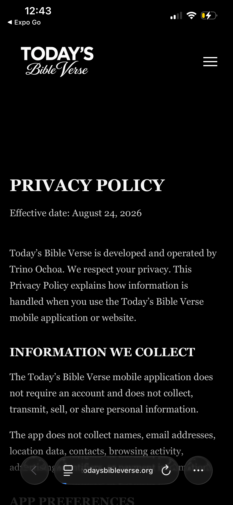

# Today's Bible Verse (Mobile App)
A cross-platform daily Bible verse and reading reminder app built with React Native and Expo.

# App preview

  
  

  
  

# Project status
- This project is currently in development.
- Check out the informational website here: https://todaysbibleverse.org/

# Features
- Display one Bible verse each day
- Schedule a preferred daily reminder time
- Repeat reminders until the verse is marked as read
- Store settings and reading status locally
- Work without requiring an account
- Coming Soon to Android and iOS

# Technology
- React Native
- Expo SDK 54
- Expo Router
- TypeScript

